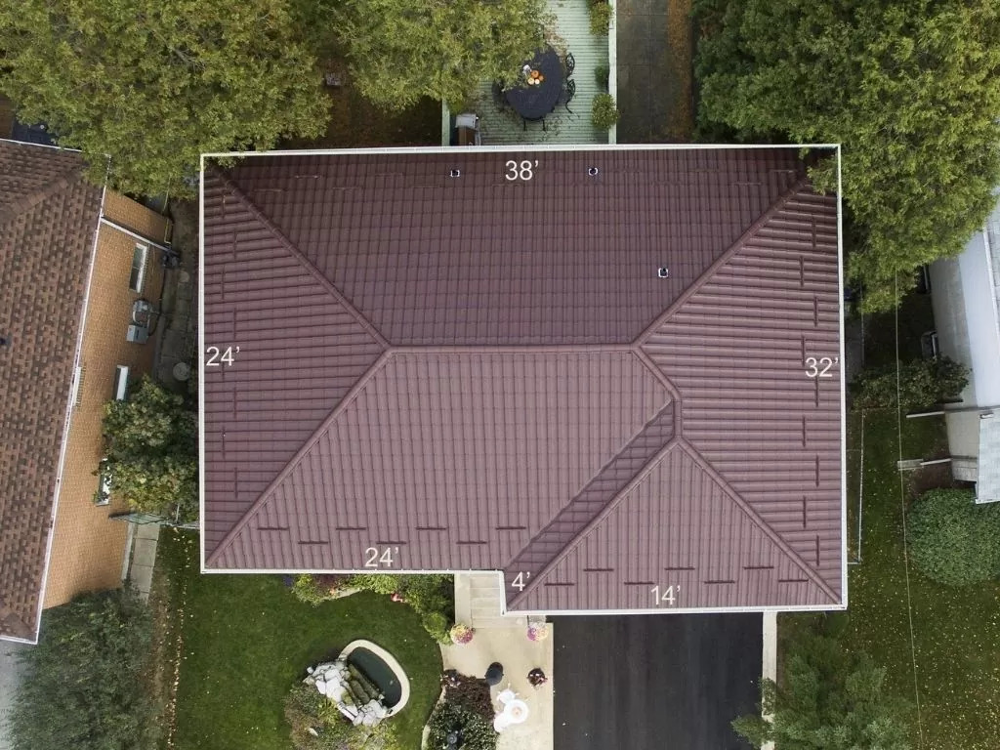
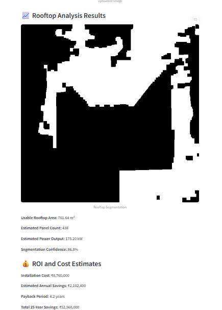

# SolarScope-AI: AI-Powered Rooftop Solar Analysis Tool

This tool analyzes satellite rooftop images to estimate solar installation potential, panel count, energy output, and return on investment (ROI).

## 🔧 Features
- Rooftop segmentation using AI
- Panel count & power generation estimates
- Installation cost & payback period calculator
- Confidence scoring

## Live Website link
 https://solarscope-ai.onrender.com/

 ## 📷 Example Use Case

 To use this tool, simply add a satellite image of a house roof or google it and download and upload the image, It will automatically generate the result.

Here's an example of the tool in action, showcasing its input and the detailed result:

**Input Image:**
A satellite image of a rooftop, provided by the user.

**Output Results:**
The tool processes the input image and generates a segmented rooftop mask along with the following calculated metrics and financial estimates:

## 🚀 Setup Instructions

### 1. Clone the repo

git clone https://github.com/your-username/solar-rooftop-analysis
cd solar-rooftop-analysis
2. Create environment and install dependencies

pip install -r requirements.txt
3. Run the app

streamlit run app.py
📷 Example Use Case
Input: Satellite image of a rooftop

Output:

Usable area: 120 m²

Panel count: 75

Power: 30 kW

Installation Cost: ₹15L

Payback: 4.2 years

25-year savings: ₹90L

🔮 Future Improvements
Integrate real satellite image APIs (e.g., Google Maps)

Use SAM/YOLO for precise rooftop detection

Location-based sun hour estimation

Export results as PDF reports

## 📄 License

This project is licensed under the MIT License - see the [LICENSE](LICENSE) file for details.

---

### MIT License

Copyright (c) Dhruv Grover

Permission is hereby granted, free of charge, to any person obtaining a copy
of this software and associated documentation files (the "Software"), to deal
in the Software without restriction, including without limitation the rights
to use, copy, modify, merge, publish, distribute, sublicense, and/or sell
copies of the Software, and to permit persons to whom the Software is
furnished to do so, subject to the following conditions:

The above copyright notice and this permission notice shall be included in all
copies or substantial portions of the Software.

THE SOFTWARE IS PROVIDED "AS IS", WITHOUT WARRANTY OF ANY KIND, EXPRESS OR
IMPLIED, INCLUDING BUT NOT LIMITED TO THE WARRANTIES OF MERCHANTABILITY,
FITNESS FOR A PARTICULAR PURPOSE AND NONINFRINGEMENT. IN NO EVENT SHALL THE
AUTHORS OR COPYRIGHT HOLDERS BE LIABLE FOR ANY CLAIM, DAMAGES OR OTHER
LIABILITY, WHETHER IN AN ACTION OF CONTRACT, TORT OR OTHERWISE, ARISING FROM,
OUT OF OR IN CONNECTION WITH THE SOFTWARE OR THE USE OR OTHER DEALINGS IN THE
SOFTWARE.
